# bmv2 on tinet

- [tinet](https://github.com/tinynetwork/tinet) だけで簡単に P4 の開発環境を作る
    - 公式チュートリアルよりも環境構築が簡単，ブラックボックスがなくてうれしい(当社比)
    - iproute2 と Docker がわかれば動かせる

## 動作検証トポロジー

- 3 つのホストがそれぞれ別のネットワーク上に存在
    - VM1: 192.168.10.10/24
    - VM2: 192.168.20.20/24
    - VM4: 192.168.30.30/24

## P4 プログラム
- 動作検証様に [公式のチュートリアル](https://github.com/p4lang/tutorials/blob/master/exercises/basic/solution/basic.p4) から持ってきました

## 使い方
1. tinet をインストールする
    - https://github.com/tinynetwork/tinet

2. tinet を利用してネットワークを作る
    - `make env` すると環境が構築されます
        - 表示されるログは実際に実行されたコマンドです(ブラックボックスがなくて素敵)

3. P4 スイッチを起動する
    - `make run` すると起動します

4. スイッチにランタイムコンフィグを設定する
    - `make set-config` すると設定が入ります

- `make  events` で P4 のイベントログが見られます
- Docker なので，よしなにコンテナに入って ping を打ったりパケットキャプチャしたり...
- FRR のノードを追加して遊んでみたり...
